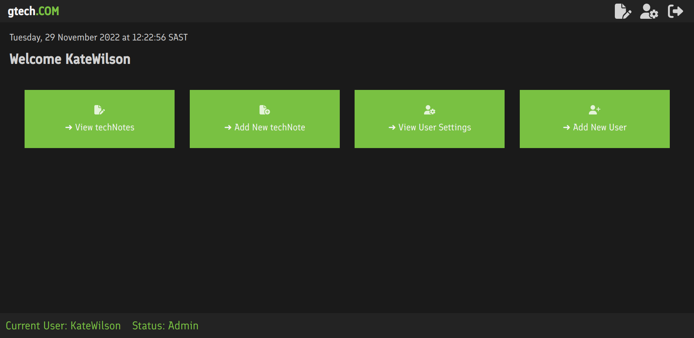
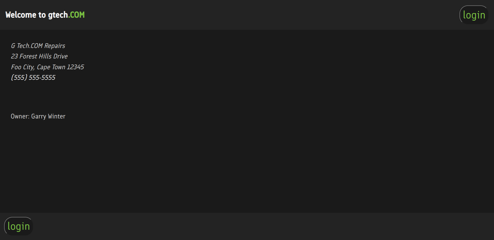
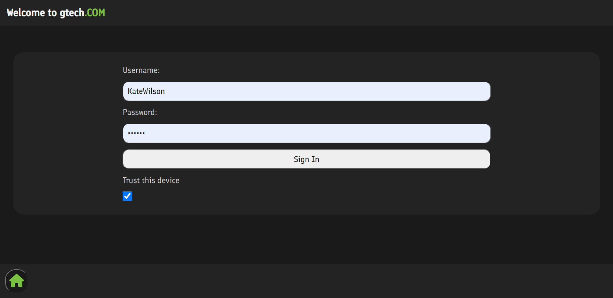
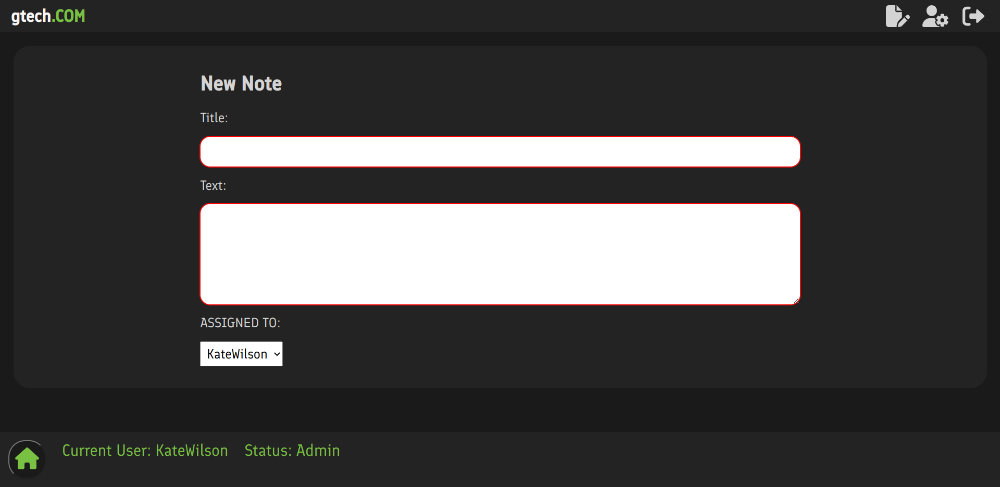
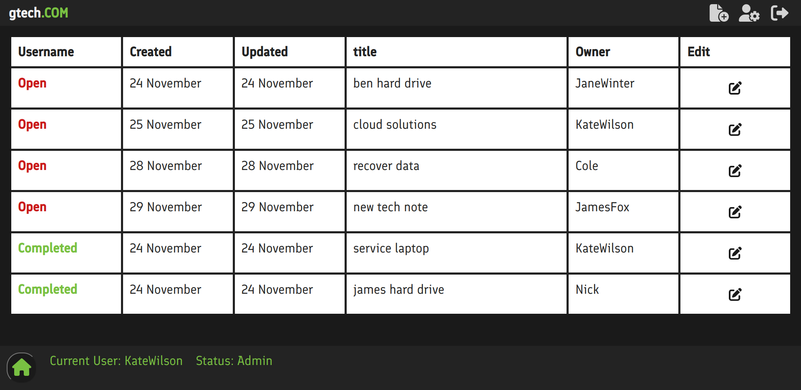
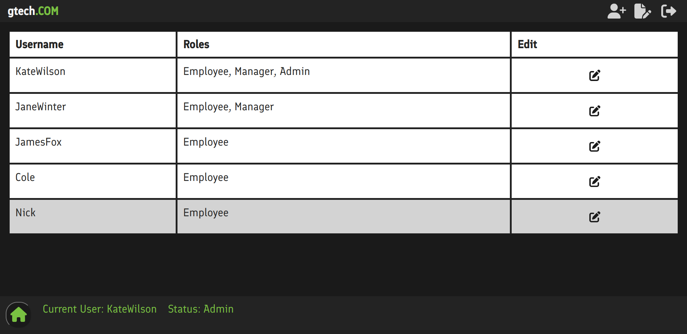
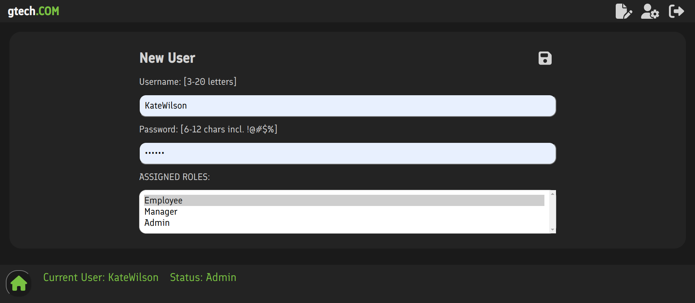

# HyperionDev Full Stack Web Development Bootcamp Level 3 - Task 15 Capstone Project

> gtech.com Notes App

## Description

This app is a Notes ticket system for a small computer repair shop. The client will be able to manage and assign tasks to employees, authenticate and save tasks on a reliable database. The app will also include features that will only be available to admin users that make it easier to manage tasks, clients and employees with a simple ui and easy navigation to increase workflow. Each employee will be able to login create tasks when attending to a client or view tasks assigned to them by the admin or manager. Only relevant tasks will be displayed to each employee which they can update based on completion but only admin users can delete tasks.
Deployed project - [gtech-app](https://gtechapp.onrender.com/)

## Table of Contents

- [Technologies](#technologies)
- [Instructions](#how-to-use)
- [System Architecture](#system-architecture)
- [System Requirements Specification](#system-requirements-specification)
- [Deployment](#deployment)

---

## Technologies

- Javascript
- React
- JSX
- CSS
- Node
- Express
- JSON Web Token
- MongoDB
- Jest, supertest (for testing)

---

## How To Use

#### Installation

Clone or download this repository.

To install the server side of the project cd into the project directory gtechApp and run npm install and npm start to run the server it will start on port [http://localhost:3001] or [http://localhost:8080].

To install the client side of the project cd into the client directory and run npm install the npm start to run the project the app will open on port [http://localhost:3000].

### important to note my security setup for the API server will only allow client side applications running on [http://localhost:3000] OR [http://localhost:3001] access to the API server or any application like postman or insomnia see config/allowedOrigins.js inside the server directory.

### step 1

When the application loads the user will be directed to the landing page which just displays the current date, time brief description of the repair shop

### step 2

This application is setup for a work environment each user is an employee at gtech.com.
To have access to the application an employee needs to have an account but only admin and manger users can create an account for each employee. For the purpose of this demonstration to login use the credentials below.
Always check trust this device on login page to stay logged in if the app refreshes.

> username: admin
> password:123456

### step 3

Once successfully authenticated you will be redirected to the dashboard which looks different based on user roles assigned by admin or manager users.

### step 4

To create a new note either click on notes icon in the navigation or click on add new note under welcome message.save button is disabled until all fields are completed.

### step 5

To view notes click view notes under welcome message or click notes icon if a user is logged in as an employee they will only see notes assigned to their account and they can update task to open or completed. If a user is logged in as admin/manager they will see all tasks assigned to each employee and only admin and mangers have complete crud functionalities on these notes.

### step 6

View users is only available for admin/mangers, click view user settings click /user icon in navigation bar.

### step 7

Add new user is only available for admin/manager users click add new user or new user icon in navigation,save button is disabled until all fields are completed. Other features no user/employee can be deleted if the have notes/tasks so the note/task must be reassigned or deleted before the employee. All users have an active status when an account is created, if active is turned off that user/employee will not be able to login until active status is reactivated.

## System Architecture

The frontend will be built using the "Create react app" starter kit. This not only makes it much quicker and easier for me to code my app, but improves the speed of the website by using a "virtual DOM", instead of rewriting the DOM every time a change is made to the HTML of the page.
Using React i'll also be taking advantage of react libraries like Redux,Redux Toolkit for state management,React Router Dom for routing and JWT decode.

The backend will be built using Nodejs and Expressjs
Express is a Nodejs web application framework that provides broad features for building web and mobile applications. As a layer built on top of Nodejs that helps manage servers and routes.Express makes Nodejs web application development fast and easy,easy to configure and customize.Includes various middleware modules which you can use to perform additional tasks on request and response,error handling middleware and easy to connect with databases such as MongoDB, Redis, MySQL.

This app will use MongoDB as a database, which is a huge advantage for performance, as there is no need for downtime when upgrading or scaling the database up. This is because Mongo uses a NoSQL database structure.

### Security

1. The app will be used in a work environment and all users will be employees of gtech.com. All users will be registered by the either the admin or manager of gtech.com. Authentication will be handled with JSON Web Token (JWT) and password stored in the database will be hashed using bcrypt.

2. "Helmet" Express middleware will be used to secure the Express backend to further tighten up security. See [https://www.npmjs.com/package/helmet](https://www.npmjs.com/package/helmet) for details.

3. The Express application also users cors with a list of allowed origins to control access to the api.

### Reliability

1. Error messages will be clear and helpful, rather than confusing messages.

2. As stated above, validation will reduce issues due to users entering blank form fields or accidentally deleting articles.

3. App will use MongoDB for the database. This eliminates the need to be worried about backing up tasks, since that is all handled by MongoDB.

4. Mongo also allows for upgrades/updates to the database with no downtime to the website.

---

## system requirements specification

### User Stories

1. Replace current sticky note system
2. Add a public facing page with basic contact info
3. Add an employee login to the notes app
4. Provide a welcome page after login
5. Provide easy navigation
6. Display current user and assigned role
7. Provide a logout option
8. Require users to login at least once per week
9. Provide a way to remove employee access asap if needed
10. Notes are assigned to specific employees
11. Notes have a ticket #, title, note body, created & updated dates
12. Notes are either OPEN or COMPLETED
13. Users can be Employees, Managers, or Admins
14. Notes can only be deleted by Managers or Admins
15. Anyone can create a note (when customer checks-in)
16. Employees can only view and edit their assigned notes
17. Managers and Admins can view, edit, and delete all notes
18. Only Managers and Admins can access User Settings
19. Only Managers and Admins can create new users
20. Desktop mode is most important but should be available in mobile

---

### Functional Requirements

1. A user will only need a username and password to create an account
2. The software shall have a dashboard that lists all the tasks.
3. When a user clicks add task on the home page a form will be displayed on the screen to capture the tasks details.
4. User clicks on submit button
   to add the task to the database and redirected to the dashboard.
5. When User clicks on update a form will be displayed to make changes or update the progress status of a task.
6. The app shall have a filter for recorded tasks matching the criteria entered by the user and display results.
   7.Only admin and managers can add new users
   8.Only admin and managers can delete tasks

---

### Non-functional Requirements

1. The application shall be secure from hackers.

2. The application shall have a database that stores all the data requirements of the application.

3. The application shall be backed up and and able to be restored.

4. The shall be responsive for mobile usage.

5.The application shall be compatible with chrome and firefox browsers.

---

## Deployment

The app will be deployed on render.com
[https://render.com/] which is free and easy to use for static and web service applications, that can be automatically deployed through a github repository.

---

## References

- Website - [HyperionDev](https://www.hyperiondev.com/)

## Author Info

- linkedin - [@gauta-ncholo](https://www.linkedin.com/in/gauta-ncholo/)
- Website - [Gauta Ncholo Portfolio](https://therealblackgold.github.io/Gauta-Ncholo-Resume/)
